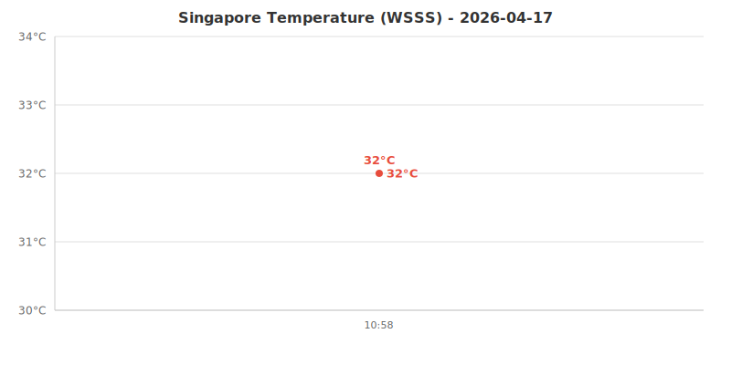

# Singapore Weather Monitor

Real-time temperature monitoring for Singapore Changi Airport (WSSS).

Data collected every 5 minutes from 10:00 to 18:00 (UTC+8) via GitHub Actions.

## Today's Temperature (2026-04-24)

## Data

Historical data files are stored in the [`data/`](data/) directory, one JSON file per day.
